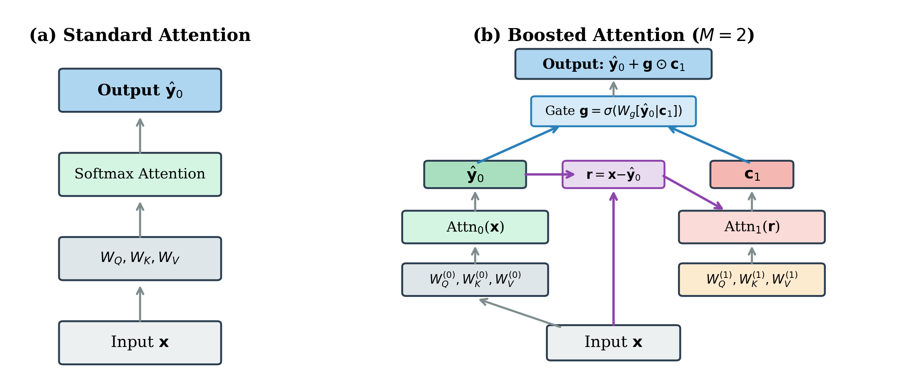

# Gradient Boosting within a Single Attention Layer

This repository contains the code and experiments for the paper:

> **Gradient Boosting within a Single Attention Layer**
> Saleh Sargolzaei, University of Windsor

We introduce *gradient-boosted attention*, a mechanism that applies gradient boosting within a single attention layer. A second attention pass, with its own learned projections, attends to the prediction error of the first pass and applies a gated correction. Under a squared reconstruction objective, the construction maps onto Friedman's MART framework, with each attention pass as a base learner and the per-dimension gate as the shrinkage parameter.

<p align="center">
  
</p>

## Results

On a 10M-token subset of WikiText-103:

| Model | Test PPL | Parameters |
|-------|----------|------------|
| Standard (d=256) | 72.2 | 7.4M |
| Twicing (d=256) | 69.6 | 7.4M |
| Standard (d=288, param-fair) | 69.0 | 8.8M |
| **Gradient-boosted (d=256, M=2)** | **67.9** | 8.7M |

## Repository Structure

```
boosted-attention/
├── paper/
│   ├── main.tex              # Paper source (NeurIPS format)
│   ├── references.bib        # Bibliography
│   ├── make_figures.py       # Architecture + results figures
│   └── neurips_2026.sty      # Style file
├── experiments/
│   ├── exp_lm_v2.py          # WikiText-103 training (Standard, Boosted, Twicing)
│   ├── exp_analysis.py       # Post-hoc analysis (gate values, entropy, examples)
│   ├── exp_ablations.py      # Ablation studies (rounds, gate types)
│   ├── exp_deq_dual_path.py  # DEQ negative results
│   └── exp_learned_routing.py# Routing gate negative results
├── src/
│   └── boosted_attention.py  # Core BoostedAttention module
├── results/
│   └── exp_v2_small.json     # Experiment results
└── requirements.txt
```

## Getting Started

### Installation

```bash
pip install -r requirements.txt
```

### Training

Train all four configurations (Standard, Twicing, param-fair, Boosted) on WikiText-103:

```bash
python experiments/exp_lm_v2.py --scale small
```

Each run takes approximately 30 minutes on a single GPU (tested on NVIDIA RTX 2000 Ada, 16GB).

### Analysis

Run post-hoc analysis on saved checkpoints (gate values, attention entropy, example corrections):

```bash
python experiments/exp_analysis.py
```

### Generating Figures

```bash
python paper/make_figures.py
```

## Citation

```bibtex
@article{sargolzaei2026gradient,
  title={Gradient Boosting within a Single Attention Layer},
  author={Sargolzaei, Saleh},
  journal={arXiv preprint},
  year={2026}
}
```

## License

MIT
