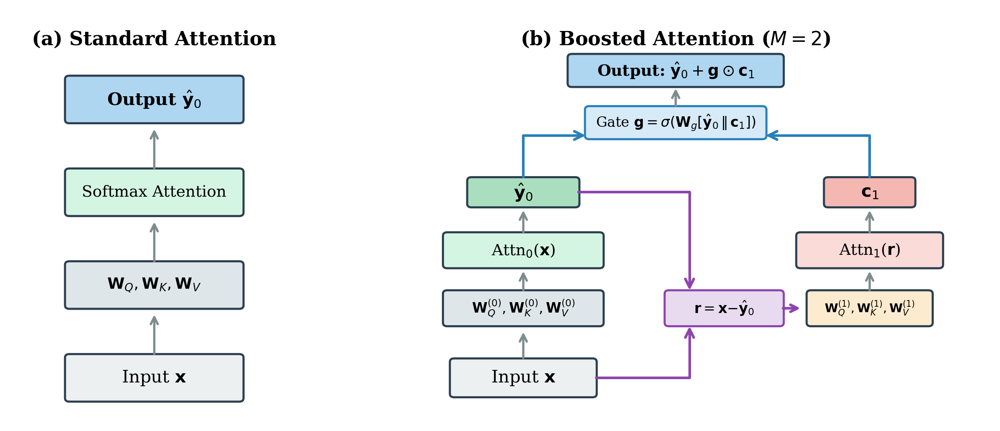

# Gradient Boosting within a Single Attention Layer

[](https://arxiv.org/abs/2604.03190)
[](LICENSE)

This repository contains the code and experiments for the paper:

> **[Gradient Boosting within a Single Attention Layer](https://arxiv.org/abs/2604.03190)**
> Saleh Sargolzaei, University of Windsor

We introduce *gradient-boosted attention*, a mechanism that applies gradient boosting within a single attention layer. A second attention pass, with its own learned projections, attends to the prediction error of the first pass and applies a gated correction. Under a squared reconstruction objective, the construction maps onto Friedman's MART framework, with each attention pass as a base learner and the per-dimension gate as the shrinkage parameter.

<p align="center">
  
</p>

## Results

| Model | Params | WikiText-103 | OpenWebText |
|-------|--------|-------------|-------------|
| Standard (d=256) | 7.4M | 72.2 | 114.9 |
| Twicing (d=256) | 7.4M | 69.6 | 110.7 |
| Standard (d=288, param-fair) | 8.8M | 69.0 | 110.2 |
| **Gradient-boosted (M=2)** | **8.7M** | **67.9** | **108.5** |

## Repository Structure

```
boosted-attention/
├── paper/
│   ├── main.tex              # Paper source (NeurIPS format)
│   ├── references.bib        # Bibliography
│   ├── make_figures.py       # All paper figures
│   └── neurips_2026.sty      # Style file
├── experiments/
│   ├── exp_lm_v2.py          # Language modeling (WikiText-103, OpenWebText)
│   ├── exp_analysis.py       # Post-hoc analysis (gate values, entropy, convex hull)
│   ├── exp_ablations.py      # Ablation studies (rounds, gate types, scaling)
│   ├── analysis_token_freq.py# Token frequency analysis
│   ├── exp_deq_dual_path.py  # DEQ negative results
│   └── exp_learned_routing.py# Routing gate negative results
├── src/
│   ├── attention.py          # Core attention modules (Standard, Boosted, Twicing)
│   └── __init__.py
├── results/
│   ├── exp_v2_small.json               # WikiText-103 results
│   ├── exp_v2_openwebtext_small.json   # OpenWebText results
│   ├── exp_v2_wikitext103_small_postln.json # Post-LN ablation results
│   ├── analysis_gate_values.json       # Gate analysis data
│   ├── analysis_convex_hull.json       # Convex hull escape data
│   ├── analysis_token_freq.json        # Token frequency analysis
│   └── exp11_summary.json              # DEQ experiment results
└── requirements.txt
```

## Getting Started

### Installation

```bash
pip install -r requirements.txt
```

### Training

Train all four configurations on WikiText-103:

```bash
python experiments/exp_lm_v2.py --scale small
```

Train on OpenWebText:

```bash
python experiments/exp_lm_v2.py --scale small --dataset openwebtext
```

Post-LN ablation:

```bash
python experiments/exp_lm_v2.py --scale small --ln_type post --attn standard boosted
```

### Analysis

Run post-hoc analysis on saved checkpoints (gate values, attention entropy, example corrections):

```bash
python experiments/exp_analysis.py
```

### Generating Figures

```bash
python paper/make_figures.py
```

## Citation

```bibtex
@misc{sargolzaei2026gradientboostingsingleattention,
  title={Gradient Boosting within a Single Attention Layer}, 
  author={Saleh Sargolzaei},
  year={2026},
  eprint={2604.03190},
  archivePrefix={arXiv},
  primaryClass={cs.LG},
  url={https://arxiv.org/abs/2604.03190},
}
```

## License

MIT
